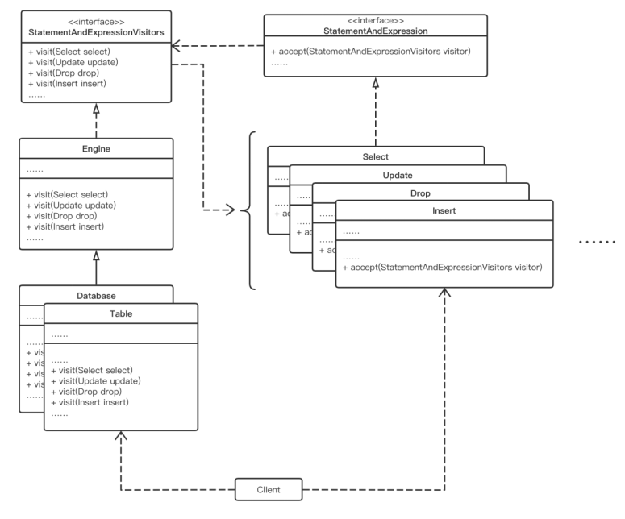

# ToyDB: Implementation of Relational Database Management System

*Rui Chen, Haoyang Zhang, Kevin Qi*

## Architecture

We applied a design pattern: visitor design pattern to execute the whole syntax tree and react properly.



### Visitor Design Pattern

Each node of the **syntax tree** represents a token or the parent of a group of tokens. Because there are a **large number** of different tokens and potential combinations, it would be very **inconvenient** to judge the type of each syntax tree node by listing a bunch of **if-statements** and calling the corresponding function. Here is where the design pattern kicks in.

According to the idea of **double dispatch**, as long as the same function, e.g., accept(), is implemented in each type of node in the syntax tree, we can **simply** call node.accept() regardless of its actual type, and then there will be the chance for the node to tell the world of its actual type. **Visitor design pattern** goes a step further than this by directly calling the corresponding function for handling this type of node inside the accept() function, so **without the tedious if-statements** judging the node’s type, we can direct the nodes into the correct function as well, also **without any further modification** requirements of the node’s classes.

### Main Memory Execution

Once the program gets a line of SQL queries, the query will be parsed into a **syntax tree** by an open-source SQL parser called JSqlParser. Luckily, all nodes generated by JSqlParser defined an accept() function to do the **double dispatch**. The **root** of the syntax tree will be **dispatched** to the corresponding function of our **database** **instance**. Once our database instance gets the syntax tree, the rest would be **executing** it **recursively**. One thing important to notice is that, since a double dispatch is performed for each recursion, the type of child nodes is unknown for the recursion caller, so the **return** **type** of all **node**-**handling** **functions** should be **uniform**. Thus we use **logic tables**, table instances having the **same structure** as a concrete table but not recorded by the database as a concrete table, to **contain all results and values** transmitted between functions.

## Query Input Manager

A command-line editor.

- ’>’ at the beginning of the line means the program is ready to take the user input.
- Support multi-line input. In order to finish the input of a query, just leave an empty line.
- If you want to exit the program, type ‘**exit**’ and press the Enter key twice.

## Data Definition Language

### 1. CREATE TABLE, DROP TABLE
Supported data types: 

- “char”, “varchar()” as  java.lang.String
- “int”, “integer” as java.lang.Integer

Column level constraints:

- Unique
- Not null (by default)

Table level constraints:

- Primary key
- Foreign key

### 2. CREATE INDEX

Implemented a single attribute index, compatible with **both unique and non-unique** **columns** with hashtable. Once create index statement is input, a new hashtable will be created and take the specified column as key and corresponding rows as value. Note that primary keys are indexed by default, create index on primary key columns is not allowed.

### 3. DROP INDEX

We take MS SQL Server’s dialect as our drop index syntax, formed like “DROP INDEX TableName.IndexName”.  Database will simply delete the corresponding hashtable to drop the index.

## Data Manipulation Language

### 1. SELECT

We implemented the “select” statement with some of its fundamental sub-statements:

#### a. Select

Our “select” statement is implemented properly that will select the given columns  only and will also validate whether the column exists or not. For more information on the “where” sub-statement, we’ve extracted it below as it can be used by many other statements.

#### b. Join

For the “join” statement we implemented inner join and outer join. To be more specific, we implemented “inner join”, “left join”, “right join” and “full join”.

We also implemented **Rule-based optimization** for join statements**.** Normally, for each record in a table, we need to traverse all the records in other tables and check if these records can be joined or not according to the given rules. It has a runtime of $O(\prod^{n}_{i=1}\text{table}_{i})$ where $\text{table}_i$ is the number of records of $\text{i}^{\text{th}}$ table.

For a join statement with given rules, our program will traverse each table first and use a hashmap to **memorize the columns** from the given rules in each table respectively. Then we will traverse each record of each table along with this hashmap, so for a record we are currently visiting, we can find all the records in other tables that should be joined with this one in constant time. Therefore our **rule-based optimization** will only has a runtime of $O(\sum^{n}_{i=1}\text{table}_{i})$.

#### c. Order by

Order by statement requires results to be sorted, however, our default container of data is an unordered hashtable. So if order by is specified, the container of the result table will be a linked hashtable that is ordered by the insert order. Though the container is in different type, since they both implement the same interface, the rest of our program will remain compatible with it. The rest part of order by will be **sorting the rows** according to the specified column, and **writing the results** into the linked hashtable in ascending or descending order.

#### d. Distinct

For distinct statements, we construct a unique mapping from values in a row to a single string as key, and keep adding the key of distinct rows into a hashset, so that any presented value combination will be deleted from the result table.

#### e. Limit

Limit simply delete all rows more than the specified limit count.

### 2. WHERE

We extract the “where” statement because we use it in many places. However, it will not change that it is a **sub-statement** of other statements.

To parse and make the “where” statement functional, we must clarify its components first.

Intuitively, we have some **atomic** **operands**, such as specific values or columns; they are seen as atomic simply because they **cannot be recursively** called again.

On the other hand, the ”where” statement also consists of a large number of **operators** which can **be parsed recursively**. For instance, “And” expression or “Equal to” expression. The left and right parts of such expressions can be atomic items and other expressions that can be parsed recursively.

We implemented most of the mainly used ones below. 

- Operands:
  - Column
  - Integer Value
  - String Value
- Operators:
  - And Expression
  - Or Expression
  - Equal to (optimized with hashed indexes)
  - Not Equal to
  - Greater Than
  - GreaterEqual Than
  - Minor Than
  - MinorEqual Than
  - Parenthesis

**Atomic items** are straightforward as they are the **base case** of our syntax tree. As for the other expressions, here we will use the “And Expression” as a classic example to illustrate.

The “And Expression” uses a left-combined manner to deal with nested expressions. Each “and expression” consists of a left expression and a right expression. Our program will **recursively** visit such two expressions and our current logic table(it can be seen as a view of tables in SQL). We have such two logic tables with their results after their respective recursion calls. We will then combine these two tables by removing some records from table A that does not exist in table B.

As for indexing, since we use the hash function as our indexes, we can only optimize the “Equal to” expression to locate records in constant time.

### 3. INSERT

Insert is implemented with a full insert. Insertion of only part of the columns are not implemented. Each insertion operation will check the **data type**, **unique fields** **duplication**, and **foreign key constraints**. If there are other indexes built for the table, insertion will also update them.

### 4. DELETE

As long as the where subclause finds valid rows to delete, these rows will be deleted.

### 5. UPDATE

As long as the where subclause finds valid rows to update, the specified columns will be updated after checking **data type**, **unique fields** **duplication**, and **foreign key constraints**. Note that the **foreign** key is implemented by saving a **reference** of the dependent on that cell. If the updated value is dependent, all the cells relying on this cell will be **automatically updated** in a **cascade** manner.

## Storage Policies and Structures

Our database will follow a **load-on-start** and **save-on-exit** policy for storage, meaning that all the SQL **operations** are **done in memory**, and data will be persisted in the disk when the program exits. Since all the attributes in the database are serializable, we **serialize** our database to disk for saving and **deserialize** it from disk when loading.

## Citation

- JSQL parser: <https://github.com/JSQLParser/JSqlParser>

# Detailed instructions for demostration

## Preloaded Data

```SQL
select * from TABLES;
select * from COLUMNS;
```

## Data Definition Language

### CREATE table

- constraints(keys)
  - primary key
  ```SQL
  create table company(compName char(255), compNo int, primary key(compNo));
  create table company(compName char(255), compNo int, primary key(compNo)); -- table already exists
  ```
  - foreign key
  ```SQL
  create table employee(empName char(255), empNo int, empCNo char(255),  
  primary key(empNo), foreign key (empCNo) references company(compName));
  drop table company; -- cannot drop
  ```

#### insert not valid

```SQL
insert into company values('GU',1);
insert into company values('GWU',2);

insert into employee values('Amy',1,'GU');
insert into employee values('Tom',2,'GWUUU'); -- insert not valid

select * from employee;
```
#### update cascade
```SQL
update company set compName = 'Georgetown' where compNo = 1;
select * from employee;
```


#### delete set null
```SQL
delete from company where compNo = 1;
select * from employee;
```

### CREATE index

Before indexing:

```sql
select * from table3i where col2=75828;
```

Create index:

```sql
create index index3i on table3i(col2);
```

Select again:

```sql
select * from table3i where col2=75828;
```

Select non-existing condition with index:

```sql
select * from table3i where col2=100001;
```

Create duplicate index:

```sql
create index index3i on table4i(col2);
```

### DROP index

Drop index:

```sql
drop index table3i.index3i;
```

Drop non-existing index:

```sql
drop index table3i.index3i;
```

Select again:

```sql
select * from table3i where col2=75828;
```

## Data Manipulation Language

### SELECT

```SQL
select * from table1i;

select * from table2i;

select * from table3i;

select col1 from table1i;

select col3 from table1i; -- col3 doesn't exists in table3i
```

#### WHERE

```sql
select * from table1i where col1=1 or col1=10 or col1=100;
select * from table1i where col1=1 or col1=10 or col1=100 and col1=5;
select * from table1i where (col1=1 or col1=10 or col1=100) and col1=5;
select * from table1i where col1<100 and col1>50;
select * from table1i where col1<100 and col1>50 and col2<70;

select * from table11 where 10>=col1+col2;
select * from table1i where col1*col2<10;
select * from table1i where col1*col2<10 and col1!=1;
select * from table1i where col1+col1*col2-col1/col2<12;
```

**will recursively searching for:**

##### operands

- Column
- Integer Value
- String Value

##### operators

- And Expression `and`
- Or Expression `or`
- Equal to (optimized with hashed indexes) `=`
- Not Equal to `!=`/`<>`
- Greater Than `>`
- GreaterEqual Than `>=`
- Minor Than `<`
- MinorEqual Than `<=`
- Parenthesis `()`
- Addition `+`
- Substraction `-`
- Multiplication `*`
- Division `/`

#### JOIN

```sql
create table test (col1 int, col2 int NOT NULL, col3 int NOT NULL, PRIMARY KEY (col1));
insert into test values (1,1,1);
insert into test values (2,2,2);
insert into test values (3,3,3);
insert into test values (-5,-5,-5);
```

##### (INNER) JOIN

```sql
select * from table31 join test on table31.col1=test.col1;
select * from table31 inner join test on table31.col1=test.col1;

select * from table31 join test on table3i.col1=test.foobar; -- on statement with column name that doesn't exist!
select * from table31 join test on test.col1=test.col1; -- on statement with column names both from same table with same column
select * from table31 join test on table31.col1=table31.col2; -- on statement with column names both from same table only
```

##### LEFT (OUTER) JOIN

```sql
select * from table31 left join test on test.col1=table31.col1 order by table31.col1 limit 10;
```

##### RIGHT (OUTER) JOIN

```sql
select * from table31 right join test on test.col1=table31.col1;
```

##### FULL (OUTER) JOIN

```sql
select * from table31 full join test on test.col1=table31.col1 order by table31.col1 limit 10;
```

##### Optimization

###### COST-BASED

```sql
select * from table11 join table1i on table11.col1=table1i.col1 limit 10;
```

Normally, without `indexing`, this statement would have the same speed as below:

```sql
select * from table11 join table1i limit 10;
```

And it's slow. But the first one is fast in our program. That's because our program can dynamically select join algorithm.

First it will detect whether there exists `indexing` for the current column in `on` statement. If there is one, it will directly use that `indexing`. So picking a record from this table would only cost constant time.

If there's no `indexing`,  it will then detect whether the total searching space is too large (we've set it to be 10k right now). So if the searching space is too large, it will temporarily build a `indexing` and then speed up the searching. 

On the other hand, if the searching space is not that large, we will just do `Cartesian product` for the two table and it won't be too slow.

We can try out this 100k joining 100k data to test it out.

```sql
select * from table31 join table3i on table31.col1=table3i.col1;
```

###### RULE-BASED

###### Inside WHERE Sub-clause

Cartesian product:

```sql
select table1i.col1, table21.col1, table21.col2 from table1i, table21 where table1i.col1=1 and table1i.col2=table1i.col1 limit 5;
```

Practical join condition:

```sql
select table2i.col1, table31.col1, table31.col2 from table2i, table31 where table2i.col2=table31.col1 order by table2i.col1 limit 5;
```

More complex condition expressions:

```sql
select table2i.col1, table31.col1, table31.col2 from table2i, table31 where table2i.col1>=5001 and table2i.col2=table31.col1 order by table2i.col1 limit 5;
```

#### ORDER BY

##### Default

```sql
select * from table1i order by col1;
```

##### ASC

```sql
select * from table1i order by col1 asc;
```

##### DESC

```sql
select * from table1i order by col1 desc;
```

#### LIMIT

```sql
select * from table3i order by col1 limit 10;
```

```sql
select * from table3i order by col1 desc limit 10;
```

```sql
select * from table3i where col1<=2000 order by col1 desc limit 10;
```

#### DISTINCT

ALL-field

```sql
select distinct col2 from table31;
```

Limit larger than actual results:

```sql
select distinct col2 from table31 limit 10;
```

### UPDATE

Update with value:

```sql
update table31 set col2=2 where col1=1;
```

```sql
select * from table31 order by col1 limit 5;
```

Updating non-existing row:

```sql
update table31 set col2=2 where col1=0;
```

Update with expression:

```sql
update table3i set col2=col1/col2;
```

```sql
select distinct col2 from table3i;
```

```sql
update table3i set col2=col1/col2;
```

```sql
select distinct col2 from table3i limit 5;
```


### 1 MILLION Records!

```sql
select col1 from table4i where col2=75828;
```

```sql
create index index4i on table4i(col2);
```

```sql
select col1 from table4i where col2=75828;
```

```sql
select col1 from table4i where col2>500000 order by col1 limit 5;
```

Update the index as well:

```sql
update table4i set col2=col1/col2;
```

```sql
select distinct col2 from table4i;
```

Drop the index:

```sql
drop index table4i.index4i;
```

Update again:

```sql
update table4i set col2=col1/col2;
```

```sql
select * from table4i order by col1 limit 5;
```
